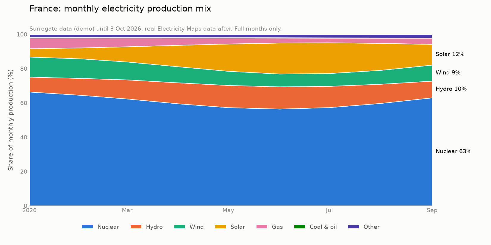
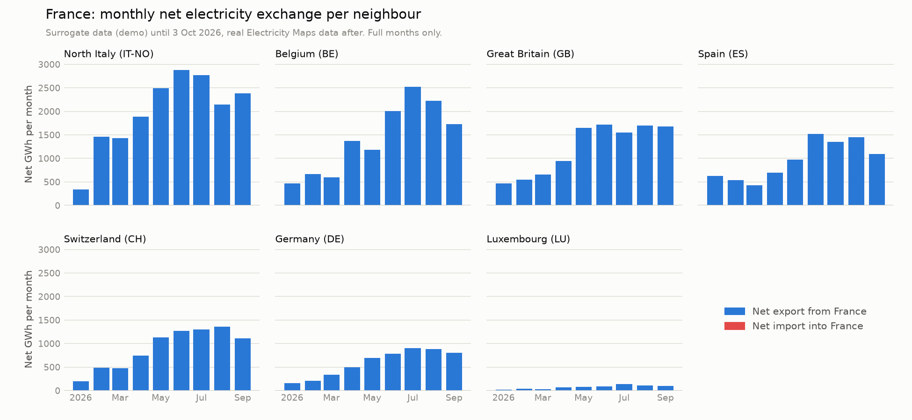

# Electricity Maps ETL pipeline

ETL pipeline for France's (FR) hourly **electricity mix** and **electricity flows** from the [Electricity Maps API](https://www.electricitymaps.com/), built with Polars, Delta Lake (delta-rs) and Dagster, following the Bronze → Silver → Gold medallion architecture. The data lake is a local folder (`data/`).

```
Electricity Maps API (/v4/electricity-mix/history, /v4/electricity-flows/history)
  │
  ▼
Bronze   raw JSON responses + ingestion metadata        partitioned by ingestion date
  │
  ▼
Silver   flat, typed, deduplicated Delta tables          partitioned by data date
  │        electricity_mix, electricity_flows
  ▼
Gold     daily data products (Delta tables)              partitioned by year
           daily_relative_mix, fr_daily_imports, fr_daily_exports
```

### Project layout

| Path | Contents |
|---|---|
| [src/emaps_etl/config.py](src/emaps_etl/config.py) | Settings (`EMAPS_*` environment variables, `.env`) |
| [src/emaps_etl/api.py](src/emaps_etl/api.py) | API client with retries |
| [src/emaps_etl/writer.py](src/emaps_etl/writer.py), [reader.py](src/emaps_etl/reader.py) | Write and read the data lake (JSON files, Delta tables) |
| [src/emaps_etl/watermark.py](src/emaps_etl/watermark.py) | High-water marks for the incremental Silver load |
| [src/emaps_etl/bronze.py](src/emaps_etl/bronze.py), [silver.py](src/emaps_etl/silver.py), [gold.py](src/emaps_etl/gold.py) | The three layers |
| [src/emaps_etl/checks.py](src/emaps_etl/checks.py) | Data quality checks |
| [src/emaps_etl/definitions.py](src/emaps_etl/definitions.py) | Dagster assets, checks and schedule |
| [src/emaps_etl/\_\_main\_\_.py](src/emaps_etl/__main__.py) | Run the pipeline once without Dagster |
| [tests/](tests/) | Unit tests, with real API responses as fixtures |
| [zones.json](zones.json) | Zone metadata (name, country), a snapshot of the API's `/v4/zones` |
| [scripts/browse.py](scripts/browse.py) | Browse the Silver and Gold tables interactively |
| [scripts/plot_gold.py](scripts/plot_gold.py), [docs/](docs/) | Charts of the Gold tables (see [Charts](#charts)) |
| [scripts/generate_surrogate_history.py](scripts/generate_surrogate_history.py) | Generates surrogate history for the current year (see [Surrogate history](#surrogate-history)) |
| [data/](data/) | The data lake, committed as the sample output: partitioned Bronze files and Silver/Gold Delta tables for the current year (see [Data lake layout](#data-lake-layout)) |
| [docs/build_pseudocode.md](docs/build_pseudocode.md) | Build order in pseudocode |
| [.github/workflows/ci.yml](.github/workflows/ci.yml) | CI: lint and tests |

## Getting started

Pick the role that matches your goal:

| Role | Goal | Needs an API key? |
|---|---|---|
| [1. Data consumer](#1-data-consumer) | Browse and analyse the data | No |
| [2. Data engineer](#2-data-engineer) | Run and maintain the pipeline | Yes |
| [3. New setup](#3-new-setup) | Set up everything from scratch, including the history of the current year | Yes |

Everything runs locally; no cloud account is needed. The tools are installed the same way for all roles: see [Install tools](#install-tools).

## 1. Data consumer

**Goal:** browse and analyse the Silver and Gold tables.

### Prerequisites

- `git`, Python 3.12 and Poetry >= 2.0 ([Install tools](#install-tools)).
- No API key or configuration.

### Steps

1. **Install the project:**

   ```bash
   git clone <repo-url> electricitymaps && cd electricitymaps
   poetry install
   ```

2. **Browse the tables** with [scripts/browse.py](scripts/browse.py). It asks for a layer (Silver or Gold) and a table, and shows its columns, row count, time range and latest rows:

   ```bash
   poetry run python scripts/browse.py    # the data lake in the repository (data/)
   ```

3. **Understand the data:** see [Data layers and schemas](#data-layers-and-schemas) for every table and column, and the [charts](#charts) for an overview. Keep in mind:
   - **All times are UTC**, and a Gold "day" is a UTC day. For French local time, convert first (see [All timestamps and days in UTC](#all-timestamps-and-days-in-utc)).
   - **Data before 3 October 2026 15:00 UTC is [surrogate history](#surrogate-history)** (generated, for demonstration only), recognisable by `estimation_method = "SURROGATE"` in `silver/electricity_mix`.
   - **The first and the current day are usually incomplete**: check `hours_covered` in Gold.

4. **Optional: use the tables in your own code**, e.g. with Polars:

   ```python
   import polars as pl

   pl.read_delta("data/gold/daily_relative_mix")
   ```

## 2. Data engineer

**Goal:** run the pipeline, keep it running on schedule and maintain it.

### Prerequisites

- `git`, Python 3.12 and Poetry >= 2.0 ([Install tools](#install-tools)).
- An Electricity Maps API key ([sandbox key](https://help.electricitymaps.com/en/articles/13169368-using-a-sandbox-api-key)).

### Steps

1. **Install the project:**

   ```bash
   git clone <repo-url> electricitymaps && cd electricitymaps
   poetry install
   ```

2. **Configure** the pipeline in `.env` (gitignored, so the API key never ends up in git; template: [.env.example](.env.example)):

   ```bash
   cp .env.example .env    # set EMAPS_API_KEY
   ```

   | Variable | Default | Meaning |
   |---|---|---|
   | `EMAPS_API_KEY` | (empty) | Electricity Maps API key. Required to fetch data (Bronze) |
   | `EMAPS_DATA_DIR` | `data/` in the repository | Folder of the data lake |
   | `EMAPS_ZONE` | `FR` | Electricity Maps zone |

3. **Run the pipeline once** (API → Bronze → Silver → Gold, about 30 seconds):

   ```bash
   poetry run dagster job execute -m emaps_etl.definitions -j etl   # with data quality checks
   poetry run python -m emaps_etl                                   # or without Dagster
   ```

4. **Keep it running with Dagster** and its schedule; see [Dagster operations](#dagster-operations) below.

5. **Check the result** with `poetry run python scripts/browse.py`, and the check results in the Dagster UI.

6. **When changing the code:** run the tests and the linter (the same checks run in GitHub Actions on every push and pull request, [ci.yml](.github/workflows/ci.yml)), regenerate the [charts](#charts) when needed, and keep this README and [docs/build_pseudocode.md](docs/build_pseudocode.md) up to date.

   ```bash
   poetry run pytest
   poetry run ruff check . && poetry run ruff format --check .
   ```

### Dagster operations

Dagster runs locally (`dagster dev`): a webserver (the UI), a daemon that starts scheduled runs, and a code server that loads [definitions.py](src/emaps_etl/definitions.py). Settings come from `.env`, which `dagster dev` loads at start-up. All Dagster state (run history, schedule on/off, logs) lives in `DAGSTER_HOME` (`.dagster/`, gitignored).

All commands below run from the repository root with:

```bash
export DAGSTER_HOME=$PWD/.dagster
```

#### Start

In the foreground (stops when the terminal closes):

```bash
mkdir -p $DAGSTER_HOME
poetry run dagster dev -m emaps_etl.definitions
```

In the background, detached from the terminal, with logs in `.dagster/dagster.log`:

```bash
mkdir -p $DAGSTER_HOME
setsid nohup .venv/bin/dagster dev -m emaps_etl.definitions > $DAGSTER_HOME/dagster.log 2>&1 < /dev/null &
```

The UI is at http://localhost:3000 once the log shows `Serving dagster-webserver`.

#### Schedule

`etl_schedule` runs the whole job (Bronze → Silver → Gold and all checks) every 12 hours, at 00:00 and 12:00 UTC. Turn it on once; the setting is stored in `DAGSTER_HOME` and survives restarts.

```bash
poetry run dagster schedule start etl_schedule -m emaps_etl.definitions   # turn on
poetry run dagster schedule stop etl_schedule -m emaps_etl.definitions    # turn off
poetry run dagster schedule list -m emaps_etl.definitions                 # status: RUNNING / STOPPED
```

Or in the UI: *Automation → etl_schedule*.

**Scheduled runs only happen while `dagster dev` is running.** When the laptop is off, asleep or Dagster is stopped, runs are skipped and not caught up later. Because the API only returns the last 24 hours, a break of more than about 24 hours leaves a permanent gap in the data (reported by the `silver_mix_no_missing_hours` check). After a break, start a manual run as soon as possible.

#### Run manually

- **UI:** *Jobs → etl → Materialize all*, or select individual assets under *Assets* and choose *Materialize selected*.
- **Command line** (does not need `dagster dev`):

  ```bash
  poetry run dagster job execute -m emaps_etl.definitions -j etl
  ```

#### Monitor

| What | Where |
|---|---|
| Run history, status and logs per step | UI: *Runs* |
| Data quality check results | UI: *Assets* → asset → *Checks* |
| Bronze files loaded into Silver per run | UI: *Assets* → Silver asset → metadata `bronze_files_loaded` |
| Next scheduled run | UI: *Automation → etl_schedule* |
| Is Dagster running? | `pgrep -af "dagster dev"`, or `curl -s -o /dev/null -w "%{http_code}" http://localhost:3000` (200 = up) |
| Process log (background start) | `tail -f .dagster/dagster.log` |

A failed blocking check (unique keys in Silver) stops the Gold assets for that run; the run shows as failed in *Runs*. A warning check (missing hours) does not stop the run.

#### Stop

```bash
pkill -f "dagster dev -m emaps_etl.definitions"
```

or `Ctrl+C` in the terminal when started in the foreground. The schedule stays turned on and resumes when Dagster starts again.

#### Troubleshooting

| Symptom | Cause and fix |
|---|---|
| Runs fail at Bronze with `401 Unauthorized` | Invalid API key, or the endpoint is not included in the API plan. Check `EMAPS_API_KEY` in `.env`. |
| Runs fail with `EMAPS_API_KEY is not set` | Add the API key to `.env`. |
| Changes to `.env` or the code have no effect | `.env` is read when `dagster dev` starts: restart it. Code changes are picked up via *Deployment* → code location `emaps_etl.definitions` → *Reload* in the UI, or by restarting. |
| `silver_mix_no_missing_hours` warns | Dagster did not run for more than 24 hours; the missing hours cannot be retrieved anymore with the trial API key. |
| Port 3000 already in use | Another `dagster dev` is running: stop it first, or start with `-p 3001`. |
| `The Poetry configuration is invalid` | An old Poetry (e.g. the Ubuntu package `python3-poetry`, 1.8) is used instead of Poetry >= 2.0: see [Install tools](#install-tools). |

## 3. New setup

**Goal:** set up the complete pipeline from scratch: an empty data lake (`EMAPS_DATA_DIR`), the history of the current year and the scheduled pipeline.

### Prerequisites

- `git`, Python 3.12 and Poetry >= 2.0 ([Install tools](#install-tools)).
- An Electricity Maps API key ([sandbox key](https://help.electricitymaps.com/en/articles/13169368-using-a-sandbox-api-key)).

### Steps

1. **Install and configure the project** as in steps 1 and 2 of [2. Data engineer](#2-data-engineer).

2. **Load the first real data** (the last 24 hours):

   ```bash
   poetry run python -m emaps_etl
   ```

3. **Optional: add [surrogate history](#surrogate-history) from 1 January of the current year**, so the data products show trends. It writes surrogate Bronze files, then rebuilds Silver and Gold from all Bronze data:

   ```bash
   poetry run python scripts/generate_surrogate_history.py
   ```

4. **Start Dagster and turn on the schedule** (see [Dagster operations](#dagster-operations)). From now on the pipeline runs every 12 hours while Dagster is running.

5. **Verify the setup:**

   ```bash
   poetry run dagster job execute -m emaps_etl.definitions -j etl    # all checks pass
   poetry run python scripts/browse.py                               # tables are readable
   ```

## Install tools

### Poetry

Poetry >= 2.0 manages the dependencies and the virtual environment. Install it with the official installer (Linux and macOS):

```bash
curl -sSL https://install.python-poetry.org | python3 -
```

This installs Poetry into `~/.local/bin`. If `poetry` is not found afterwards, add that directory to your `PATH` (e.g. in `~/.bashrc` or `~/.zshrc`):

```bash
export PATH="$HOME/.local/bin:$PATH"
poetry --version
```

Do not use the Ubuntu/Debian package `python3-poetry`: it is version 1.8, which cannot read this project's `pyproject.toml`. Make sure `~/.local/bin` comes first in your `PATH`.

### The project environment

`poetry install` creates the virtual environment in `.venv/` inside the repository (`poetry.toml` sets `virtualenvs.in-project = true`) and installs all dependencies:

| Group | Packages | Purpose |
|---|---|---|
| core | `polars`, `deltalake` | Transformations and Delta Lake tables |
| core | `requests`, `tenacity` | API client with retries and backoff |
| core | `pydantic-settings` | Typed configuration from environment variables and `.env` |
| core | `dagster`, `dagster-webserver` | Orchestration on the local machine (`dagster dev`) |
| dev | `pytest`, `ruff`, `matplotlib` | Tests, linting and formatting, charts |

Run commands with `poetry run …`, or activate the environment with `source .venv/bin/activate`. In VS Code, select `.venv/bin/python` as the interpreter. Add dependencies with `poetry add <package>` (or `poetry add --group dev <package>`), not with `pip install`, so that `pyproject.toml` and `poetry.lock` stay in sync.

## Data layers and schemas

All timestamps are UTC (see [design decisions](#all-timestamps-and-days-in-utc)). Power is in MW (average over the hour); energy is in MWh.

### Bronze: raw API responses

One JSON file per API call, stored exactly as received with minimal metadata, partitioned by **ingestion** time:

```
bronze/electricity_mix/year=2026/month=10/day=03/20261003T100410487232Z.json
bronze/electricity_flows/year=2026/month=10/day=03/20261003T100410487210Z.json
```

```json
{
  "ingested_at": "2026-10-03T10:04:10.487232+00:00",
  "source_url": "https://api.electricitymaps.com/v4/electricity-mix/history?zone=FR&temporalGranularity=hourly&disableCallerLookup=true",
  "response": { "zone": "FR", "temporalGranularity": "hourly", "unit": "MW", "history": [ ... ] }
}
```

No schema is enforced. The API key is sent as a header and never appears in the stored URL.

### Silver: clean Delta tables

Partitioned by **data** time: `year=YYYY/month=MM/day=DD` (string columns `year`, `month`, `day`). Rows are upserted with a Delta MERGE on the key, so overlapping API windows and re-runs never create duplicates; the most recent ingestion wins.

**`silver/electricity_mix`**: one row per zone, hour and source. Key: `zone, datetime_utc, source`.

| Column | Type | Description |
|---|---|---|
| `zone` | string | Zone key, e.g. `FR` |
| `datetime_utc` | timestamp (UTC) | Start of the hour |
| `source` | string | `nuclear`, `wind`, `solar`, `hydro`, `gas`, `coal`, `oil`, `biomass`, `geothermal`, `unknown`, and storage as `hydro_storage_charge`, `hydro_storage_discharge`, `battery_storage_charge`, `battery_storage_discharge` |
| `power_mw` | double | Average power in MW; null when the source is not reported |
| `estimation_method` | string | `MEASURED` or the API's estimation method; `SURROGATE` for [surrogate history](#surrogate-history) |
| `is_estimated` | boolean | True when the value is estimated |
| `updated_at` | timestamp (UTC) | When Electricity Maps last updated the value |
| `ingested_at` | timestamp (UTC) | When the pipeline fetched the value |
| `year`, `month`, `day` | string | Partition columns |

The import/export totals in the mix response are left out: `electricity_flows` has them per neighbouring zone.

**`silver/electricity_flows`**: one row per zone, hour and neighbouring zone. Key: `zone, datetime_utc, counterpart_zone`.

| Column | Type | Description |
|---|---|---|
| `zone` | string | Zone key, e.g. `FR` |
| `datetime_utc` | timestamp (UTC) | Start of the hour |
| `counterpart_zone` | string | Neighbouring zone, e.g. `ES`, `IT-NO` |
| `import_mw` | double | Power imported from the neighbour (0 when none) |
| `export_mw` | double | Power exported to the neighbour (0 when none) |
| `updated_at` | timestamp (UTC) | When Electricity Maps last updated the value |
| `ingested_at` | timestamp (UTC) | When the pipeline fetched the value |
| `year`, `month`, `day` | string | Partition columns |

### Incremental loading

Silver is loaded incrementally from Bronze with a **high-water mark** per table: the `ingested_at` of the last Bronze file loaded into it. It is stored as a small JSON file in the data lake, one per table (the two Silver tables load in parallel):

```
data/_state/watermark_silver_electricity_mix.json
{"ingested_at": "2026-10-04T18:48:47.910184+00:00"}
```

Each run ([silver.load_new_bronze](src/emaps_etl/silver.py)):

1. Reads the watermark. Without a watermark file (first run, or after the [surrogate history](#surrogate-history) rebuild), it is derived from the latest `ingested_at` in the Silver table.
2. Lists only the Bronze day folders from the watermark's date until today (Bronze is partitioned by ingestion date) and selects the files whose name, which starts with the ingestion timestamp, is newer than the watermark. Only those files are read.
3. MERGEs them into Silver.
4. Moves the watermark to the newest loaded file, **only after a successful MERGE**. If that update fails, the next run loads the same files again, which is harmless because the MERGE is idempotent.

So Bronze files are never lost between the layers: when a Silver step fails, the next run catches up with all Bronze files ingested since. In Dagster, the number of loaded files shows as `bronze_files_loaded` in the materialization metadata of the Silver assets. A run without new Bronze files loads nothing and leaves Silver unchanged.

Gold is not incremental: it is rebuilt from Silver on every run (the tables are small). The API side is not incremental either: with the trial API key, every run fetches the last 24 hours (see [Limitations](#no-historical-data-api-trial-access)).

### Gold: daily data products

Rebuilt from Silver on every run (the tables are small) and partitioned by `year`. A day is a UTC day; `hours_covered` shows how many hours of data the day contains (the first and the current day are usually incomplete).

**`gold/daily_relative_mix`** (Data Product 1): percentage contribution of each energy source to the daily production.

| Column | Type | Description |
|---|---|---|
| `date_utc` | date | UTC day |
| `period_start_utc`, `period_end_utc` | timestamp (UTC) | Start and end of the day |
| `hours_covered` | int | Hours of data in the day |
| `zone`, `zone_name`, `country_code` | string | Zone metadata, e.g. `FR`, `France`, `FR` |
| `source` | string | Energy source (storage charging is consumption and is excluded) |
| `energy_mwh` | double | Energy produced by the source that day |
| `percentage` | double | Share of the day's total production (sums to 100 per zone and day) |
| `year` | string | Partition column |

**`gold/fr_daily_imports`** and **`gold/fr_daily_exports`** (Data Product 2): net energy exchanged with each neighbour per day. Import and export with the same neighbour within a day are netted; the neighbour appears in the imports table when France is a net importer that day, otherwise in the exports table.

| Column | Type | Description |
|---|---|---|
| `date_utc` | date | UTC day |
| `period_start_utc`, `period_end_utc` | timestamp (UTC) | Start and end of the day |
| `hours_covered` | int | Hours of data in the day |
| `from_zone`, `from_zone_name`, `from_country_code` | string | Exporting zone (the neighbour for imports, `FR` for exports) |
| `to_zone`, `to_zone_name`, `to_country_code` | string | Importing zone (`FR` for imports, the neighbour for exports) |
| `net_mwh` | double | Net energy from `from_zone` to `to_zone` (always > 0) |
| `year` | string | Partition column |

### Data quality

| Check | Where | On failure |
|---|---|---|
| Schema matches the table | Delta Lake (every write) | Write rejected |
| Key columns not null; `power_mw`, `import_mw`, `export_mw` ≥ 0 | Delta `CHECK` constraints (Silver) | Write rejected |
| `percentage` between 0 and 100; `net_mwh` > 0 | Delta `CHECK` constraints (Gold) | Write rejected |
| Unique key in Silver | Dagster asset check (blocking) | Gold is not built |
| No missing hours in Silver | Dagster asset check | Warning |
| Daily percentages sum to 100 | Dagster asset check | Error |

API calls are retried with exponential backoff (up to 5 attempts) on rate limiting (429), server errors (5xx), timeouts and connection errors. Other errors, such as an invalid key (401), fail immediately.

### Data lake layout

The data lake ([data/](data/), or `EMAPS_DATA_DIR`) holds the current year: [surrogate history](#surrogate-history) from 1 January 2026 up to 3 October 2026 15:00 UTC, followed by the real data collected since. It is committed to git (about 13 MB) and serves as the sample output of this project, so all tools work right after cloning. [3. New setup](#3-new-setup) describes how to build it from scratch.

Every pipeline run adds Bronze files and new Silver and Gold versions to `data/`, so after a run `git status` shows changes there; they end up in git only when committed.

```
data/
├── bronze/electricity_mix/year=YYYY/month=MM/day=DD/<ingested_at>.json                  (real, 1 per API call)
├── bronze/electricity_mix/year=YYYY/month=MM/day=DD/<ingested_at>_surrogate_<period>.json (surrogate)
├── bronze/electricity_flows/...                                                        (same)
├── silver/electricity_mix/year=YYYY/month=MM/day=DD/part-*.parquet    (+ _delta_log/)
├── silver/electricity_flows/year=YYYY/month=MM/day=DD/part-*.parquet  (+ _delta_log/)
├── gold/daily_relative_mix/year=YYYY/part-*.parquet                   (+ _delta_log/)
├── gold/fr_daily_imports/year=YYYY/part-*.parquet                     (+ _delta_log/)
├── gold/fr_daily_exports/year=YYYY/part-*.parquet                     (+ _delta_log/)
└── _state/watermark_silver_<table>.json                              (high-water marks, see Incremental loading)
```

### Charts

Generated from the Gold tables with [scripts/plot_gold.py](scripts/plot_gold.py) (matplotlib, a dev dependency). Daily values are aggregated to full calendar months. Most of the data is [surrogate history](#surrogate-history), for demonstration only.

```bash
poetry run python scripts/plot_gold.py    # reads data/, writes docs/*.png
```

**Production mix (`daily_relative_mix`):** the share of each energy source in the monthly production.



**Net exchange per neighbour (`fr_daily_exports` and `fr_daily_imports`):** monthly net export from France (blue, above zero) or net import into France (red, below zero), on a shared scale.



## Design decisions

### Time window and granularity: multi-year, daily

The assignment does not specify the time window or the granularity of the analysis. Evaluating France's energy transition from fossil fuels to renewables is a long-term question, so the target is:

- **Time window: multiple years**, to show trends in the energy mix and in imports/exports over time.
- **Granularity: daily** for the data products in Gold. Hourly data is ingested and kept in Silver, so finer analyses remain possible.

Because of the API limitations (see [Limitations](#no-historical-data-api-trial-access)), the multi-year history cannot be loaded: the pipeline can only collect data from the moment it starts running. This repository is therefore an elementary setup to start with. The history builds up as the pipeline keeps running, and with an API key that includes historical access, past years could be backfilled.

To demonstrate the design, the data lake contains [surrogate history](#surrogate-history) for the current year; older years are left out to keep the repository small.

### Surrogate history

Because historical data cannot be loaded, [scripts/generate_surrogate_history.py](scripts/generate_surrogate_history.py) generates hourly surrogate (fake) data for the current year, from 1 January up to the most recent real API call. Each value is:

```
trend (linear from the 2021 level to today's level) × seasonality × daily cycle (solar only) × random noise
```

- **Trend:** the energy transition: solar and wind grow, gas, coal and oil decline, nuclear decreases slightly. The trend is defined over 5 years (2021 → today), so the current year sits at the end of it; today's levels are based on the real API data.
- **Seasonality:** wind, nuclear and gas higher in winter, hydro peaks in spring, solar higher in summer and zero at night.
- **Flows:** net export per neighbour with a trend, seasonality (fewer exports in winter) and a random deviation per day, so some days are net imports.
- **Reproducible:** fixed random seed; standard library only, no extra dependencies.

The surrogate data goes through the normal pipeline: the script writes Bronze files in the API's JSON format to the data lake (one file per stream and month), deletes the Silver and Gold tables and the watermarks, and rebuilds the tables from all Bronze data (the watermarks are re-derived on the next run). It arrives in the standard columns; no extra columns are added. It can be recognised by:

- **Bronze:** `source_url` starts with `surrogate://`, and the file name contains `_surrogate_`.
- **Silver:** `estimation_method = "SURROGATE"` in `electricity_mix` (`electricity_flows` has no such column).
- **Time:** all data before **3 October 2026 15:00 UTC** is surrogate; real API data starts there. In Gold, every day before 3 October 2026 is fully surrogate, 3 October is mixed (15 surrogate hours, 9 real), and later days are real.

Real hours from earlier API calls are replaced by surrogate data (the most recent ingestion wins), so the dataset has a clean split: surrogate before the most recent real API call, real from then on. This also removes the gap of 4 hours (3 October 2026, 11:00–14:00 UTC) between the first two real runs. Surrogate data is for demonstration only and must not be used for analysis.

### Polars + delta-rs instead of PySpark or Pandas

The pipeline uses [Polars](https://pola.rs/) for transformations and [delta-rs](https://delta-io.github.io/delta-rs/) (`deltalake`) for Delta Lake tables.

- **Lightweight:** pure `pip` install, no JVM, no Spark cluster or session start-up. Runs instantly on a laptop and in CI.
- **Fits the data volume:** hourly data for a single zone is megabytes, not terabytes; distributed processing adds overhead without benefit.
- **No infrastructure:** Delta tables are plain folders with Parquet files and a transaction log; delta-rs needs no Spark, Hadoop or metastore.
- **Fast:** Polars is multi-threaded, columnar and supports lazy evaluation.

### Local Dagster orchestration instead of AWS Step Functions / Lambda

The pipeline is orchestrated by [Dagster](https://dagster.io/), running locally (`dagster dev`).

- **No Step Functions:** a serverless setup needs a state machine, EventBridge schedule, extra IAM roles, log groups and a deployment pipeline. That adds complexity and running cost that this assignment does not need.
- **No Lambda:** the runtime dependencies (Polars, delta-rs) are about 324 MB, above Lambda's 250 MB limit for zip packages. Lambda would therefore require a container image, Docker and an ECR repository.
- **Dagster runs on a laptop:** no server, database or Docker needed; run history is stored in SQLite.
- **Fits the medallion architecture:** Bronze, Silver and Gold tables are modelled as Dagster assets, so the UI shows the lineage between the layers; data quality checks run as asset checks.
- **Trade-off:** schedules only run while `dagster dev` is running. Unattended production scheduling would require hosting Dagster (or moving to a managed orchestrator).

### Local data lake instead of cloud storage

The data lake is a local folder (`data/`) instead of cloud storage such as S3.

- **Anyone can run it end to end** with only an Electricity Maps API key: no cloud account, infrastructure, credentials or roles.
- **Simple and fast:** a full run takes about 30 seconds; on S3 the many small daily partitions made runs several times slower.
- **API key in `.env`:** gitignored, so it never ends up in the repository.
- **Trade-off:** the data is not shared live; the current year is committed in [data/](data/) as the shared sample. Moving to cloud storage later is contained: all file access goes through [writer.py](src/emaps_etl/writer.py) and [reader.py](src/emaps_etl/reader.py), and delta-rs supports S3, Azure and GCS natively.

### Data contracts as Delta table constraints

Schemas and data quality rules are enforced by the Delta tables themselves, instead of a separate validation library (such as Pandera) or YAML contract files.

- **Explicit Polars schemas** define column names and types for the Silver tables; data is built with these schemas before writing.
- **Delta Lake enforcement:** delta-rs rejects writes whose schema does not match the table, and enforces `CHECK` constraints (e.g. key columns not null, `power_mw >= 0`, `percentage` between 0 and 100). A violating write fails as a whole and nothing is committed. The constraints are stored in the table's Delta log, so they apply to every writer, not just this pipeline.
- **Cross-row checks** that constraints cannot express (unique keys, daily percentages summing to 100%, missing hours) run as Dagster asset checks.
- **Fewer dependencies:** no Pandera or PyYAML.

### Incremental Silver load with a high-water mark

Silver loads only the Bronze files ingested since the last successful load, tracked by a high-water mark per table (see [Incremental loading](#incremental-loading)).

- **Why a high-water mark:** Silver reads its input from Bronze in the data lake instead of receiving it directly from the Bronze step of the same run. When a Silver step fails, the next run catches up with all Bronze files since the last successful load, and Silver can also be run on its own.
- **Stored as a small JSON file in the data lake** (`_state/watermark_silver_<table>.json`): the state lives next to the data it describes, without an extra database or service.
- **Not derived from Silver on every run:** reading `max(ingested_at)` scans a column across all daily partitions of the Silver table. It is only used as a fallback when the watermark file is missing.
- **One file per table:** the two Silver tables load in parallel; separate files avoid one run overwriting the other's watermark.
- **Safe order:** the watermark moves only after a successful MERGE; if that update fails, the files are loaded again, which is harmless because the MERGE is idempotent.

### All timestamps and days in UTC

All timestamps, partitions (`year=YYYY/month=MM/day=DD`) and daily aggregations use **UTC**, the time zone the Electricity Maps API returns.

- **Consistent:** Bronze, Silver and Gold use the same clock as the source data, so no conversions are needed between layers.
- **No daylight saving issues:** every UTC day has exactly 24 hours, whereas local days in France have 23 or 25 hours on the daylight saving transitions.
- **Explicit column names:** time columns carry the time zone in their name or type (e.g. `date_utc`, `period_start_utc`).

**Note for French data consumers:** a Gold "day" is a UTC day, which runs from 01:00 to 01:00 French time in winter (CET, UTC+1) and from 02:00 to 02:00 in summer (CEST, UTC+2). For local assessments, convert the UTC timestamps to French time (`Europe/Paris`) before aggregating, e.g. in Polars:

```python
df.with_columns(pl.col("datetime_utc").dt.convert_time_zone("Europe/Paris").alias("datetime_paris"))
```

## Limitations

### No historical data (API trial access)

The API key used for this assignment only has access to the `latest` and `history` endpoints. The `past` and `past-range` endpoints return `401 Unauthorized` ("This endpoint is not included in your API trial") for every zone and data type.

As a result:

- **No backfill:** historical data cannot be loaded. The dataset starts at the first pipeline run and grows from there.
- **Ingestion uses `history`:** `GET /v4/electricity-mix/history` and `GET /v4/electricity-flows/history` return the last 24 hours of hourly data.
- **Run at least once every 24 hours:** a longer gap between runs leaves hours that can no longer be retrieved. The Dagster schedule runs every 12 hours, so a single missed run does not leave a gap.
- **Overlapping windows are expected:** consecutive runs return overlapping hours; Silver deduplicates them on the natural key and keeps the most recent ingestion.

With a key that includes `past-range` access, the pipeline could backfill by looping over windows of at most 10 days (the limit for hourly data per request).
